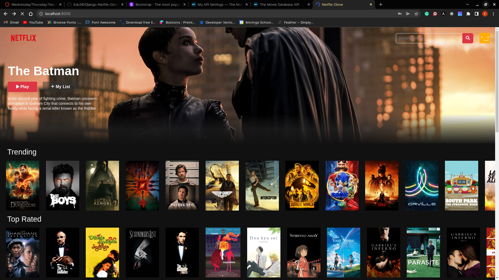

# Django-Netflix-Clone
This is a netflix clone built with Django, Bootstrap 5, themoviedb API and PostgreSQL. ALl the data is sourced from the API. Users can signup, login, view movie posters, watch the trailers and search for movies or tv shows.




## Getting Started

- Type the following command in your terminal to clone this repository

```
git clone https://github.com/Edu58/Django-Netflix-Clone.git
```

If you are using SSH, use the following command

```
git clone git@github.com:Edu58/Django-Netflix-Clone.git
```

When you run the commands successfully, you should have a local version of this repository.

### Prerequisites

- A computer with Python 3 install. Check [here](https://realpython.com/installing-python/) for
  further [instructions](https://realpython.com/installing-python/)
- Access to the Internet
- An IDE of your choice e.g. Pycharm, VS Code, Sublime Text

### Installing

Before starting the application, run ```pip install -r requirements.txt``` to install the project dependencies.

To run the app, unzip the cloned folder if it is zipped. Otherwise, navigate inside the folder and
run ```python manage.py runserver``` or ```python manage.py server``` in your terminal. Any of these 2 should start the
server at
localhost:8000. Once the server is running, open your browser and enter localhost:8000 in your url bar of your
preferred browser, and you should be able to use the app now. This will only work on the computer running the server. It
is not available to anyone else. You should see something similar to the image below on clicking a single image.

## Deployment

This project can be deployed for free on Heroku. Follow
these [instructions](https://realpython.com/django-hosting-on-heroku/) to deploy.

## Built With

* [Django](https://www.djangoproject.com/) - The web framework used
* [Django-Bootstrap-V5](https://pypi.org/project/django-bootstrap-v5/) - CSS Framework
* [JQuery](https://jquery.com/) - Javascript Library used for fade effects
* [PostgreSQL](https://www.postgresql.org/) - Database used

## Known Bugs
My List feature is not working

Feel free to submit a pull request or reach out at edumuriithi58@gmail.com.

## Contributing

Feel free to submit a pull request or reach out at edumuriithi58@gmail.com.

## Authors

* **Edwin Karimi** - *Initial work* - [Django-Netflix-Clone](https://github.com/Edu58/Django-Netflix-Clone)

- Twitter - [@GISDevEd](https://twitter.com/GISDevEd)
- Linkedin - [edwin-karimi](https://www.linkedin.com/in/edwin-karimi/)
  <br>
  <br>
- No contributors yet

## License

This project is licensed under the MIT License - see the [LICENSE.md](LICENSE) file for details


